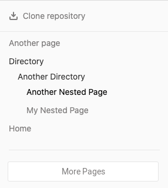

# Wiki

Если вы не хотите хранить документацию в своем репозитории, но хотите хранить ее в том же проекте, что и ваш код, вы можете использовать вики, предоставляемую GitLab в каждом проекте GitLab. Каждая вики представляет собой отдельный репозиторий Git, поэтому вы можете создавать вики-страницы в веб-интерфейсе или <mark style="color:purple;">локально с помощью Git</mark>.

Вики GitLab поддерживают Markdown, Rdoc, AsciiDoc и Org для контента. Страницы Wiki, написанные в Markdown, поддерживают все [функции Markdown](https://docs.gitlab.com/ee/user/markdown.html), а также обеспечивают некоторые особенности поведения ссылок.

В [GitLab 13.5 и более поздних версиях](https://gitlab.com/gitlab-org/gitlab/-/issues/17673/) на вики-страницах отображается боковая панель, которую вы <mark style="color:purple;">можете настроить</mark>. Эта боковая панель содержит частичный список страниц вики, отображаемый в виде вложенного дерева, где одноуровневые страницы перечислены в алфавитном порядке. Чтобы просмотреть список всех страниц, выберите **View All Pages** на боковой панели:

<figure><figcaption></figcaption></figure>

## Просмотр вики проекта

Чтобы получить доступ к вики проекта:

1. На левой боковой панели выберите **Search or go to** и найдите свой проект.
2. Чтобы отобразить вики, выполните одно из следующих действий:
   * На левой боковой панели выберите **Plan > Wiki**
   * На любой странице проекта используйте `g + w` [wiki keyboard shortcut](https://docs.gitlab.com/ee/user/shortcuts.html)

Если **Plan > Wiki** не указан на левой боковой панели вашего проекта, администратор проекта <mark style="color:purple;">отключил его</mark>.

## Настройте ветку по умолчанию для вашей вики

> [Представлено](https://gitlab.com/gitlab-org/gitlab/-/issues/221159) в GitLab 14.1.

Ветка по умолчанию для вашего вики-репозитория зависит от вашей версии GitLab:

* _GitLab версии 14.1 и новее_: Wiki наследуют имя ветки по умолчанию, настроенное для вашего экземпляра или группы. Если пользовательское значение не настроено, GitLab использует **main**.
* _GitLab версий 14.0 и более ранних_: GitLab использует **master**.

Для любой версии GitLab вы можете [переименовать эту ветку по умолчанию](https://docs.gitlab.com/ee/user/project/repository/branches/default.html#update-the-default-branch-name-in-your-repository) для ранее созданных вики.

## Создайте домашнюю страницу вики

Когда вики создается, она пуста. При первом посещении вы можете создать домашнюю страницу, которую пользователи будут видеть при просмотре вики. Для этой страницы требуется определенный заголовок, который будет использоваться в качестве домашней страницы вашей вики. Чтобы создать его:

1. На левой боковой панели выберите **Search or go to** и найдите свой проект или группу.
2. Выберите **Plan > Wiki**.
3. Выберите **Create your first page**.
4. GitLab требует, чтобы первая страница называлась **home**. Страница с таким заголовком служит главной страницей вашей вики.
5. Выберите **Format** для стилизации текста.
6. Добавьте приветственное сообщение на свою домашнюю страницу в разделе **Content**. Вы всегда сможете отредактировать его позже.
7. Добавьте **Commit message**. Git требует сообщения о фиксации, поэтому GitLab создаст его, если вы не введете его самостоятельно.
8. Выберите **Create page**.

## Создать новую вики-страницу

Пользователи с ролью разработчика не ниже могут создавать новые вики-страницы:

1. На левой боковой панели выберите **Search or go to** и найдите свой проект или группу.
2. Выберите **Plan > Wiki**.
3. Выберите **New page** на этой странице или любую другую вики-страницу.
4. Выберите формат контента.
5. Добавьте заголовок для вашей новой страницы. В заголовках страниц используются [специальные символы](wiki.md#specialnye-simvoly-v-zagolovkakh-stranic) для подкаталогов и форматирования, а также имеются [ограничения по длине](wiki.md#ogranicheniya-dliny-dlya-imen-failov-i-katalogov).
6. Добавьте контент на свою вики-страницу.
7. Необязательно. Прикрепите файл, и GitLab сохранит его в репозитории Git вики.
8. Добавьте **Commit message**. Git требует сообщения о фиксации, поэтому GitLab создаст его, если вы не введете его самостоятельно.
9. Выберите **Create page**.

### Создайте или отредактируйте вики-страницы локально

Вики-сайты основаны на репозиториях Git, поэтому вы можете клонировать их локально и редактировать так же, как и любой другой репозиторий Git. Чтобы клонировать репозиторий вики локально, выберите **Clone repository** на правой боковой панели любой страницы вики и следуйте инструкциям на экране.

Файлы, которые вы добавляете в свою вики локально, должны использовать одно из следующих поддерживаемых расширений, в зависимости от языка разметки, который вы хотите использовать. Файлы с неподдерживаемыми расширениями не отображаются при отправке в GitLab:

* Расширения Markdown: `.mdown`, `.mkd`, `.mkdn`, `.md`, `.markdown`
* Расширения AsciiDoc: `.adoc`, `.ad`, `.asciidoc`
* Другие расширения разметки: `.textile`, `.rdoc`, `.org`, `.creole`, `.wiki`, `.mediawiki`, `.rst`

### Специальные символы в заголовках страниц

Страницы Wiki хранятся в виде файлов в репозитории Git, поэтому некоторые символы имеют особое значение:

* При сохранении страницы пробелы преобразуются в дефисы.
* Дефисы (`-`) при отображении страницы преобразуются обратно в пробелы.
* Косая черта (`/`) используется в качестве разделителя путей и не может отображаться в заголовках. Если вы создаете заголовок, содержащий символы `/`, GitLab создает все подкаталоги, необходимые для создания этого пути. Например, заголовок `docs/my-page` создает вики-страницу с путем `/wikis/docs/my-page`.

### Ограничения длины для имен файлов и каталогов

> [Представлено](https://gitlab.com/gitlab-org/gitlab/-/merge\_requests/24364) в GitLab 12.8.

Многие распространенные файловые системы имеют [ограничение на имена файлов и каталогов в 255 байт](https://en.wikipedia.org/wiki/Comparison\_of\_file\_systems#Limits). Git и GitLab поддерживают пути, превышающие эти ограничения. Однако, если ваша файловая система применяет эти ограничения, вы не сможете извлечь локальную копию вики, содержащую имена файлов, превышающие этот предел. Чтобы предотвратить эту проблему, веб-интерфейс и API GitLab накладывают следующие ограничения:

* 245 байт для заголовков страниц (10 байт резервируется для расширения файла)
* 255 байт для имен каталогов

Символы, отличные от ASCII, занимают более одного байта.

Хотя вы по-прежнему можете локально создавать файлы, превышающие эти ограничения, ваши товарищи по команде могут не иметь возможности впоследствии просматривать вики локально.
