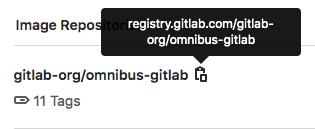

# Реестр контейнеров

> Поиск по имени репозитория изображений был [представлен](https://gitlab.com/gitlab-org/gitlab/-/merge\_requests/31322) в GitLab 13.0.

Вы можете использовать интегрированный реестр контейнеров для хранения образов контейнеров для каждого проекта GitLab.

Чтобы включить реестр контейнеров для вашего экземпляра GitLab, см. <mark style="color:purple;">документацию администратора</mark>.


Если вы извлекаете образы контейнеров Docker из Docker Hub, вы можете использовать [прокси-сервер зависимостей](proksi-zavisimostei.md) GitLab, чтобы избежать ограничений скорости и ускорить работу конвейеров. Дополнительную информацию о реестре Docker см. на странице [https://docs.docker.com/registry/introduction/](https://docs.docker.com/registry/introduction/).


## Просмотр реестра контейнеров

Вы можете просмотреть реестр контейнеров для проекта или группы.

1. На левой боковой панели выберите **Search or go to** и найдите свой проект или группу.
2. Для:
   * группы выберите **Operate > Container Registry**.
   * проекта выберите **Deploy > Container Registry**.

Вы можете искать, сортировать, фильтровать и <mark style="color:purple;">удалять</mark> образы контейнеров. Вы можете поделиться отфильтрованным представлением, скопировав URL-адрес из браузера.

Только участники проекта или группы могут получить доступ к реестру контейнеров частного проекта. Образы контейнеров, загруженные из частного реестра, могут быть доступны <mark style="color:purple;">другим пользователям в общем runner</mark>.

Если проект является общедоступным, реестр контейнеров также является общедоступным.

### Просмотр тегов определенного образа контейнера в реестре контейнеров

Вы можете использовать страницу сведений о тегах реестра контейнеров, чтобы просмотреть список тегов, связанных с данным образом контейнера:

1. На левой боковой панели выберите **Search or go to** и найдите свой проект или группу.
2. Для:
   * группы выберите **Operate > Container Registry**.
   * проекта выберите **Deploy > Container Registry**.
3. Выберите образ контейнера.

Вы можете просмотреть подробную информацию о каждом теге, например, когда он был опубликован, сколько места он занимает, а также дайджесты манифеста и конфигурации.

На этой странице вы можете искать, сортировать (по имени тега), фильтровать и <mark style="color:purple;">удалять</mark> теги. Вы можете поделиться отфильтрованным представлением, скопировав URL-адрес из браузера.

## Использование образов контейнеров из реестра контейнеров

Чтобы загрузить и запустить образ контейнера, размещенный в реестре контейнеров:

1. На левой боковой панели выберите **Search or go to** и найдите свой проект или группу.
2. Для:
   * группы выберите **Operate > Container Registry**.
   * проекта выберите **Deploy > Container Registry**.
3. Найдите образ контейнера, с которым хотите работать, и выберите **Copy**.

<figure><figcaption></figcaption></figure>

4. Используйте `docker run` со скопированной ссылкой:

```bash
docker run [options] registry.example.com/group/project/image [arguments]
```


Чтобы загрузить образы контейнеров из частного репозитория, вам необходимо <mark style="color:purple;">пройти аутентификацию в реестре контейнеров</mark>.


Дополнительную информацию о запуске образов контейнеров см. в [документации Docker](https://docs.docker.com/get-started/).

## Соглашение об именах для образов контейнеров

Ваши образы контейнеров должны соответствовать следующему соглашению об именах:

```
<registry URL>/<namespace>/<project>/<image>
```

Например, если ваш проект — `gitlab.example.com/mynamespace/myproject`, то образ вашего контейнера должен называться `gitlab.example.com/mynamespace/myproject`.

Вы можете добавить дополнительные имена в конец имени образа контейнера глубиной до двух уровней.

Например, все это допустимые имена для образов контейнеров в проекте `myproject`:

```
registry.example.com/mynamespace/myproject:some-tag
```

```
registry.example.com/mynamespace/myproject/image:latest
```

```
registry.example.com/mynamespace/myproject/my/image:rc1
```

## Перемещение или переименование репозитория реестра контейнеров

Перемещение или переименование существующих репозиториев реестра контейнеров не поддерживается после отправки образов контейнеров. Образы контейнеров хранятся по пути, соответствующему пути к репозиторию. Чтобы переместить или переименовать репозиторий с помощью реестра контейнеров, необходимо удалить все существующие образы контейнеров. Предложения сообщества по обходу этой известной проблемы опубликованы в [issue 18383](https://gitlab.com/gitlab-org/gitlab/-/issues/18383#possible-workaround).

## Отключение реестра контейнеров для проекта

Реестр контейнеров включен по умолчанию.

Однако вы можете удалить реестр контейнеров для проекта:

1. На левой боковой панели выберите **Search or go to** и найдите свой проект.
2. Выберите **Settings > General**.
3. Разверните раздел **Visibility, project features, permissions** и отключите **Container Registry**.
4. Выберите **Save changes**.

Запись **Deploy > Container Registry** будет удалена с боковой панели проекта.

## Изменение видимости реестра контейнеров

> [Представлено](https://gitlab.com/gitlab-org/gitlab/-/issues/18792) в GitLab 14.2.

По умолчанию реестр контейнеров виден всем, у кого есть доступ к проекту. Однако вы можете изменить видимость реестра контейнеров для проекта.

Дополнительные сведения о разрешениях, которые этот параметр предоставляет пользователям, см. в разделе [Разрешения на видимость реестра контейнеров](reestr-konteinerov.md#razresheniya-na-vidimost-reestra-konteinerov).

1. На левой боковой панели выберите **Search or go to** и найдите свой проект.
2. Выберите **Settings > General**.
3. Разверните раздел **Visibility, project features, permissions**
4. В разделе **Container Registry** выберите вариант из раскрывающегося списка:
   * **Everyone With Access** (по умолчанию). Реестр контейнеров виден всем, у кого есть доступ к проекту. Если проект является общедоступным, реестр контейнеров также является общедоступным. Если проект является внутренним или частным, реестр контейнеров также является внутренним или частным.
   * **Only Project Members**. Реестр контейнеров виден только участникам проекта с ролью не ниже **Reporter**. Эта видимость аналогична поведению частного проекта с видимостью реестра контейнеров, установленной на **Everyone With Access**.
5. Выберите **Save changes**.

## Разрешения на видимость реестра контейнеров

Возможность просмотра реестра контейнеров и получения образов контейнеров контролируется разрешениями на видимость реестра контейнеров. Вы можете изменить видимость с помощью [настройки видимости в пользовательском интерфейсе](reestr-konteinerov.md#izmenenie-vidimosti-reestra-konteinerov) или <mark style="color:purple;">API</mark>. Этот параметр не влияет на <mark style="color:purple;">другие разрешения</mark>, такие как обновление реестра контейнеров, а также отправку или удаление образов контейнеров. Однако отключение реестра контейнеров отключает все операции с реестром контейнеров.

<table><thead><tr><th width="257"></th><th width="160"></th><th width="114">Anonymous (Everyone on internet)</th><th>Guest</th><th>Reporter, Developer, Maintainer, Owner</th></tr></thead><tbody><tr><td>Публичный проект с видимостью реестра контейнеров установлено значение <strong>Everyone With Access</strong> (UI) или <code>enabled</code> (API).</td><td>Просмотр реестра контейнеров и затягивание образа</td><td>Да</td><td>Да</td><td>Да</td></tr><tr><td>Публичный проект с видимостью реестра контейнеров установлено значение <strong>Only Project Members</strong> (UI) или <code>private</code> (API).</td><td>Просмотр реестра контейнеров и затягивание образа</td><td>Нет</td><td>Нет</td><td>Да</td></tr><tr><td>Внутренний проект с видимостью реестра контейнеров, установлено значение <strong>Everyone With Access</strong> (UI) или <code>enabled</code> (API).</td><td>Просмотр реестра контейнеров и затягивание образа</td><td>Нет</td><td>Да</td><td>Да</td></tr><tr><td>Внутренний проект с видимостью реестра контейнеров установлено значение <strong>Only Project Members</strong> (UI) или <code>private</code> (API).</td><td>Просмотр реестра контейнеров и затягивание образа</td><td>Нет</td><td>Нет</td><td>Да</td></tr><tr><td>Частный проект с видимостью реестра контейнеров, установлено значение <strong>Everyone With Access</strong> (UI) или <code>enabled</code> (API).</td><td>Просмотр реестра контейнеров и затягивание образа</td><td>Нет</td><td>Нет</td><td>Да</td></tr><tr><td>Частный проект с видимостью реестра контейнеров установлено значение <strong>Only Project Members</strong> (UI) или <code>private</code> (API).</td><td>Просмотр реестра контейнеров и затягивание образа</td><td>Нет</td><td>Нет</td><td>Да</td></tr><tr><td>Любой проект с отключенным реестром <code>disabled</code>.</td><td>Все операции с реестром контейнеров</td><td>Нет</td><td>Нет</td><td>Нет</td></tr></tbody></table>

## Поддерживаемые типы образов

Реестр контейнеров поддерживает форматы образов [Docker V2](https://docs.docker.com/registry/spec/manifest-v2-2/) и [Open Container Initiative (OCI)](https://github.com/opencontainers/image-spec/blob/main/spec.md).

Поддержка OCI означает, что вы можете размещать в реестре форматы образов на основе OCI, например [пакеты диаграмм Helm 3+](https://helm.sh/docs/topics/registries/). В GitLab <mark style="color:purple;">API</mark> и пользовательском интерфейсе нет различия между форматами образов. [Issue 38047](https://gitlab.com/gitlab-org/gitlab/-/issues/38047) устраняет это различие, начиная с Helm.
